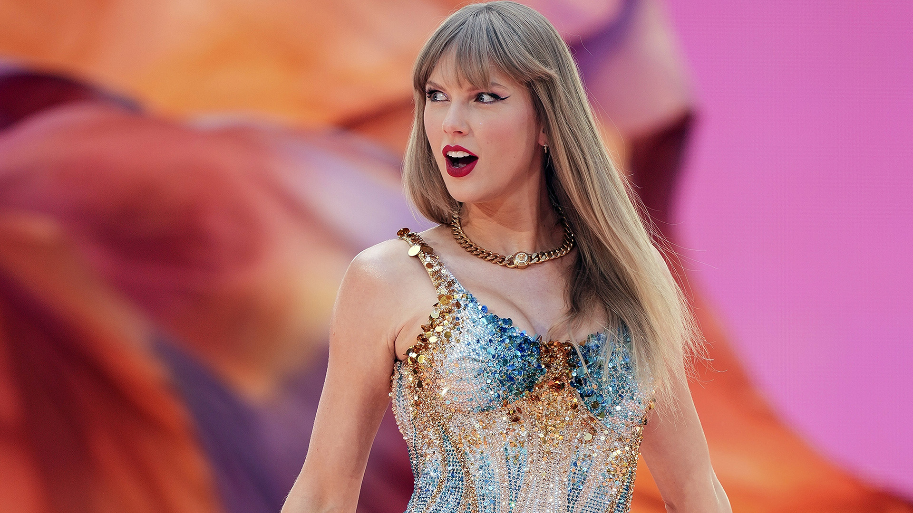

# swift-code



> *none of it was accidental*

A Claude Code plugin that plays music while Claude works.

Turn it on, and every time you send Claude Code a prompt, a random song from your Spotify playlists starts playing (right around the chorus, so you don't wait through a slow intro) and loops until Claude finishes responding. Then it stops. Ships with a Taylor Swift playlist by default, but you can point it at any playlist you like.

Works on **Windows** and **macOS**.

## What it actually does

- You type `/swift-code:on` once at the start of a session.
- From then on, every prompt you send kicks off a song, looping, in the background.
- The moment Claude finishes replying, the music stops.
- `/swift-code:off` turns it back off whenever you want.

Nothing plays until you turn it on, and it automatically resets to "off" when you close the session, so you're never surprised by music starting in a session you didn't mean to enable it in.

## Install it

The plugin is written in PowerShell, which runs on both platforms. Windows already has it. macOS needs it installed once, and needs one line changed so the hooks call `pwsh` instead of `powershell`.

<details open>
<summary><b>Windows</b></summary>

Clone it straight into your Claude Code skills folder so it loads automatically, every session, with no flags:

```powershell
git clone https://github.com/ganeshhgupta/swift-code.git "$env:USERPROFILE\.claude\skills\swift-code"
```

That's the whole install. Nothing else to configure.

</details>

<details open>
<summary><b>macOS</b></summary>

1. Install PowerShell, if you don't have it:

   ```bash
   brew install --cask powershell
   ```

   Check it worked with `pwsh --version`. On macOS the command is `pwsh`; there is no `powershell`.

2. Clone into your skills folder:

   ```bash
   git clone https://github.com/ganeshhgupta/swift-code.git ~/.claude/skills/swift-code
   ```

3. Point the hooks and skills at `pwsh`:

   ```bash
   cd ~/.claude/skills/swift-code
   sed -i '' 's/"command": "powershell"/"command": "pwsh"/g' hooks/hooks.json
   sed -i '' 's/^powershell /pwsh /g' skills/*/SKILL.md
   ```

   Skipping this step is the one thing that will make the plugin silently do nothing on a Mac: the hooks fire, macOS can't find a program called `powershell`, and you get no music and no error.

</details>

Claude Code picks up anything in `~/.claude/skills/` on startup, so if you're already in a session, start a new one. There is no config to register and no flag to pass: the hooks in `hooks/hooks.json` are the *invisible string* tying your prompts to the music.

## Connect it to your Spotify account

This plays music through the real Spotify app on your account, so it needs its own Spotify credentials. Takes about two minutes, and it's free. The steps are identical on both platforms.

1. Go to the [Spotify Developer Dashboard](https://developer.spotify.com/dashboard) and log in.
2. Click **Create app**. Name and description can be anything.
3. For **Redirect URI**, enter this exactly: `http://127.0.0.1:8888/callback`
4. Under "Which API/SDKs are you planning to use?", tick only **Web API**.
5. Save, then open the app and copy the **Client ID**.
6. Copy `config.example.json` to `config.json` in the plugin folder, and paste your Client ID in:

   ```json
   {
     "client_id": "paste-your-client-id-here",
     "redirect_uri": "http://127.0.0.1:8888/callback"
   }
   ```

7. Run the login script once. It opens your browser, asks you to approve access to your own account, and saves a token locally. Nothing ever leaves your machine.

   **Windows**

   ```powershell
   powershell -File "$env:USERPROFILE\.claude\skills\swift-code\scripts\spotify-auth.ps1"
   ```

   **macOS**

   ```bash
   pwsh -File ~/.claude/skills/swift-code/scripts/spotify-auth.ps1
   ```

That's it. The saved token refreshes itself automatically after this, so you won't need to log in again.

## Turn it on

Open Spotify somewhere. The desktop app, your phone, the web player, even a smart speaker, anywhere you're logged in. Then in Claude Code type:

```
/swift-code:on
```

Send a prompt and the music should start. When you're done, either say:

```
/swift-code:off
```

or just close the session. It cleans up after itself either way.

## Add or remove playlists

It comes with one playlist tracked by default (Taylor Swift). To change what it pulls from, just ask in plain English. No command syntax to remember:

- **"add this playlist: https://open.spotify.com/playlist/..."**
- **"what playlists do you have?"**
- **"remove the Taylor Swift playlist"**

Claude handles the rest. Every prompt after that randomly picks a song from whatever's currently tracked.

## Good to know

- You need **Spotify Premium**. Free accounts can't be controlled through Spotify's API, only viewed.
- `config.json` and `tokens.json` are gitignored on purpose. Never commit or share those; they're tied to your Spotify account.
- Songs start about 65% of the way through, which usually lands somewhere around the chorus or hook, and loop from there until Claude's done.
- It borrows your player rather than taking it over. Before starting anything it records your current shuffle and repeat settings, and when the turn ends it puts them back *right where you left* them.
- Spotify's playlist-items endpoint is blocked for apps in Development Mode, so the plugin can't read a playlist's track list directly. It works around this by turning on shuffle, starting the playlist, and reading back whichever track Spotify picked.

## Troubleshooting

Nothing here fails loudly. If the music simply never arrives, it is almost always one of these.

| Symptom | Cause |
|---|---|
| Nothing happens on macOS, no error | The `sed` step in the install was skipped, so the hooks are still calling `powershell` |
| `config.json missing` | You copied the Client ID into `config.example.json` instead of a new `config.json` |
| `tokens.json missing` | The `spotify-auth.ps1` login step hasn't been run yet |
| Auth window never opens | Open the URL the script prints by hand; the browser launch is best-effort |
| Music starts but stops instantly | No active Spotify device. Play something in Spotify first so it has somewhere to send playback |
| 403 from Spotify | Free account. Playback control needs Premium |
